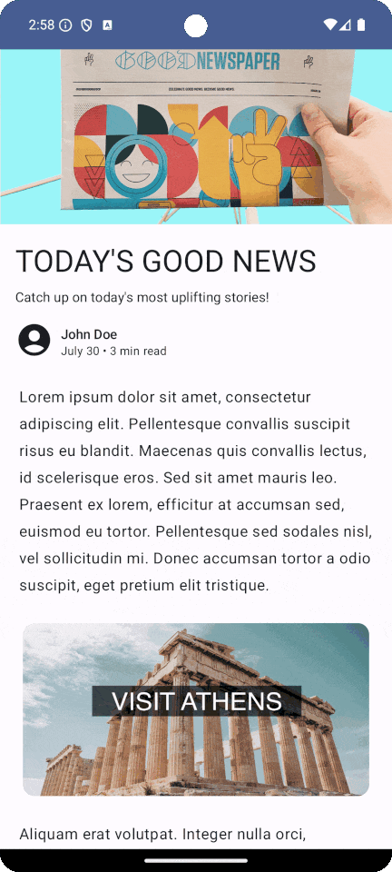

# bidding-auction-local-testing-app

The B&A Local Testing App (LTA) is a companion application to Bidding & Auction Service for Privacy Sandbox, and runs locally alongside the B&A Services stacks on your development machine or VM. The LTA can be configured to work with either [web](#web-clients) or [mobile](#mobile-clients) B&A clients.

## Web Client Demo

The LTA provides locally-running DSP and SSP test servers that allow you to test a variety of different auction scenarios from a web client, including:

* On-device-only auction
* B&A-only auction
* Mixed-mode auction
* Multi-seller auction

It also provides a demo web app to facilitate testing these scenarios:

[Start setting up the web client demo.](/web.md)

## Mobile Client Demo

The LTA provides locally-running DSP and SSP test servers that allow you to test a B&A auction from a mobile client.

It works alongside the [Project Flight](https://github.com/privacysandbox/project-flight) sample Android apps to demonstrate how an advertiser app and publisher app can participate in a B&A auction:

[Start setting up the mobile client demo.](/mobile.md)