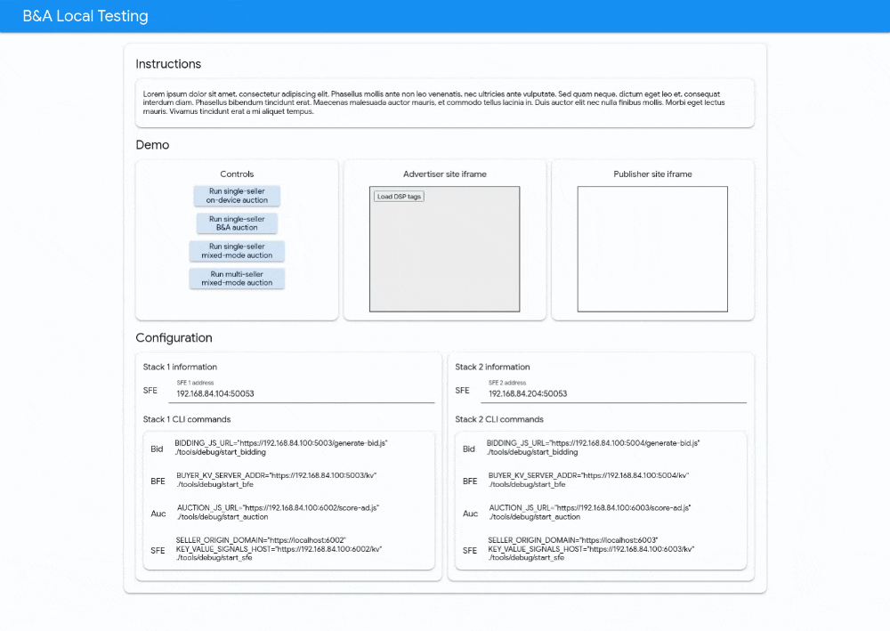
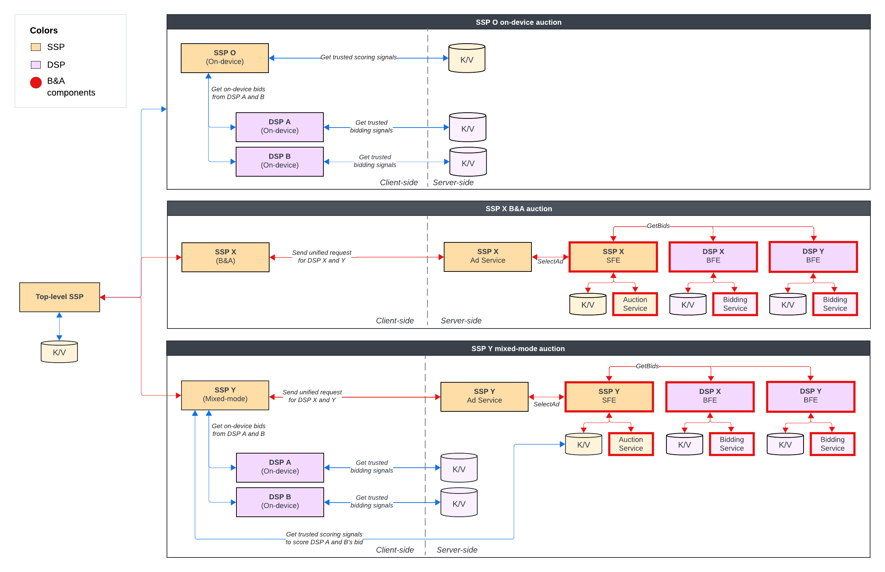

# bidding-auction-local-testing-app



Local Testing App for Bidding and Auction Services

## Description

The B&A Local Testing App (LTA) is a companion application to Bidding & Auction Service for Privacy Sandbox, and runs locally alongside the B&A Services stacks on your machine or VM. 

To ease the B&A testing process, the LTA provides the following participants: 
* DSPs 
  * On-device-only auctions: `DSP-A` and `DSP-B`
  * B&A-only auctions: `DSP-X` and `DSP-Y`
* SSPs 
  * On-device-only auction: `SSP-OD`
  * B&A-only auction: `SSP-BA`
  * Mixed-mode auction: `SSP-MIX`
  * Multi-seller auction: `SSP-TOP`

Each participant provides mock bidding/scoring logic for B&A running locally can use.

After starting all the services and LTA, you can visit localhost:3000 to run different auction configurations such as mixed-mode and multi-seller auctions.

## Quickstart

TL;DR: 
1. Setup prerequisites
2. Setup repositories
3. Build the services
4. Build and start the local companion app
5. Start the services
6. Visit localhost:3000, click "Load DSP tags", and click "Run auction" button

### Setup prerequisites

#### Prepare a linux machine

Use a linux local machine, or provision a linux VM of the cloud provider of your choice. Note that we will be connecting to http://localhost:3000 of this machine. If the VM does not provide a GUI, then make sure the port is accessible to your local machine so you can connect to it. 

#### Install Docker

```bash
# Install Docker
> curl -fsSL https://get.docker.com -o get-docker.sh
> sudo sh get-docker.sh

# Test
> docker run hello-world

# Setup sudo-less Docker
> sudo groupadd docker
> sudo usermod -aG docker $USER
> newgrp docker
```

> With the sudo-less setup, the docker group grants root-level privileges to the user. Read the [sudo-less Docker](https://docs.docker.com/engine/install/linux-postinstall/#manage-docker-as-a-non-root-user) guide to learn more. 

### Setup the services

#### Pull down the Bidding and Auction Services repository

For our demo, we will be using two sets of B&A to simulate auctions involving multiple buyers and sellers. 

Set 1: 
```bash
git clone https://github.com/privacysandbox/bidding-auction-servers.git bidding-auction-servers-set-a
```

Set 2: 
```bash
git clone https://github.com/privacysandbox/bidding-auction-servers.git bidding-auction-servers-set-b
```

#### Build the services

Execute the following command from the root of each set's repository to build the services: 

```bash
./production/packaging/build_and_test_all_in_docker \
  --service-path bidding_service \
  --service-path auction_service \
  --service-path buyer_frontend_service \
  --service-path seller_frontend_service \
  --platform gcp \
  --instance local \
  --no-precommit \
  --no-tests \
  --build-flavor non_prod \
  --gcp-skip-image-upload
```

This step may take up to 3 hours on an 8-core machine and an hour on a 32-core machine (Sorry! We are working on improving this process!).  

[Relevant xkcd meme](https://xkcd.com/303/): 


### Build and run Local Testing App

Pull down this repository: 

```bash
git clone https://github.com/privacysandbox/bidding-auction-local-testing-app.git
```

From the root of the repository, run the setup script: 

```bash
./setup
```

The setup script will create the `ba-dev` Docker network, generate SSL certificates, and build the images. 

Once the build is successful, run the start script: 

```bash
./start
```

### Open Chrome

Start Chrome from the command line with the following flags: 
```
google-chrome --enable-privacy-sandbox-ads-apis --disable-features=EnforcePrivacySandboxAttestations,FledgeEnforceKAnonymity --enable-features=FledgeBiddingAndAuctionServerAPI,FledgeBiddingAndAuctionServer:FledgeBiddingAndAuctionKeyURL/https%3A%2F%2Fstorage.googleapis.com%2Fba-test-buyer%2Fcoordinator-test-key.json 
```

The flag is set to let Chrome know to use the mock coordinator key that we have hosted at [https://storage.googleapis.com/ba-test-buyer/coordinator-test-key.json](https://storage.googleapis.com/ba-test-buyer/coordinator-test-key.json)

Make sure you have fully exited out of all Chrome instances before opening it from the command line with the B&A flags. To exit out of all Chrome processes, try running `ps aux | grep -ie chrome/chrome | awk '{print $2}' | xargs kill -9` from the command line.

### Open the page in Chrome

Visit the UI at http://localhost:3000 or your VM's address and `:3000`.  

### Start the services in local mode

Execute each command in a separate terminal window. A window manager such a [`tmux`](https://github.com/tmux/tmux/wiki) is highly recommended.

#### Set 1 (DSP-X and SSP-BA)

Run the following commands in root folder of the first B&A set

##### DSP-X Bidding Service

```bash
DOCKER_RUN_ARGS_STRING="--ip=192.168.84.101 --network=ba-dev" \
BIDDING_JS_URL=https://192.168.84.100:5003/generate-bid.js \
SKIP_TLS_VERIFICATION=true \
  ./tools/debug/start_bidding
```

##### DSP-X BFE Service

```bash
DOCKER_RUN_ARGS_STRING="--ip=192.168.84.102 --network=ba-dev" \
BUYER_KV_SERVER_ADDR=https://192.168.84.100:5003/kv \
BIDDING_SERVER_ADDR=192.168.84.101:50057 \
SKIP_TLS_VERIFICATION=true \
  ./tools/debug/start_bfe
```

##### SSP-BA Auction Service 

```bash
DOCKER_RUN_ARGS_STRING="--ip=192.168.84.103 --network=ba-dev" \
AUCTION_JS_URL="https://192.168.84.100:6002/score-ad.js" \
SKIP_TLS_VERIFICATION=true \
  ./tools/debug/start_auction
```

##### SSP-BA SFE Service A

```bash
DOCKER_RUN_ARGS_STRING="--ip=192.168.84.104 --network=ba-dev" \
SELLER_ORIGIN_DOMAIN="https://localhost:6002" \
AUCTION_SERVER_ADDR="192.168.84.103:50061" \
KEY_VALUE_SIGNALS_ADDR="https://192.168.84.100:6002/kv" \
BUYER_SERVER_ADDRS_JSON='{"https://localhost:5003":{"url":"192.168.84.102:50051","cloudPlatform":"LOCAL"},"https://localhost:5004":{"url":"192.168.84.202:50051","cloudPlatform":"LOCAL"}}' \
SKIP_TLS_VERIFICATION=true \
  ./tools/debug/start_sfe
```

#### Set 2 (DSP-Y and SSP-MIX)

Run the following commands in root folder of the second B&A set

##### DSP-Y Bidding Service

```bash
DOCKER_RUN_ARGS_STRING="--ip=192.168.84.201 --network=ba-dev" \
BIDDING_JS_URL=https://192.168.84.100:5004/generate-bid.js \
SKIP_TLS_VERIFICATION=true \
  ./tools/debug/start_bidding
```

##### DSP-Y BFE Service

```bash
DOCKER_RUN_ARGS_STRING="--ip=192.168.84.202 --network=ba-dev" \
BUYER_KV_SERVER_ADDR=https://192.168.84.100:5004/kv \
BIDDING_SERVER_ADDR=192.168.84.201:50057 \
SKIP_TLS_VERIFICATION=true \
  ./tools/debug/start_bfe
```

##### SSP-MIX Auction Service

```bash
DOCKER_RUN_ARGS_STRING="--ip=192.168.84.203 --network=ba-dev" \
AUCTION_JS_URL="https://192.168.84.100:6003/score-ad.js" \
SKIP_TLS_VERIFICATION=true \
  ./tools/debug/start_auction
```

##### SSP-MIX SFE Service

```bash
DOCKER_RUN_ARGS_STRING="--ip=192.168.84.204 --network=ba-dev" \
SELLER_ORIGIN_DOMAIN="https://localhost:6003" \
AUCTION_SERVER_ADDR="192.168.84.203:50061" \
KEY_VALUE_SIGNALS_ADDR="https://192.168.84.100:6002/kv" \
BUYER_SERVER_ADDRS_JSON='{"https://localhost:5003":{"url":"192.168.84.102:50051","cloudPlatform":"LOCAL"},"https://localhost:5004":{"url":"192.168.84.202:50051","cloudPlatform":"LOCAL"}}' \
SKIP_TLS_VERIFICATION=true \
  ./tools/debug/start_sfe
```

## Design

* `SSP-TOP` - The top-level seller 
* `SSP-BA` - B&A-only seller
* `SSP-MIX` - Mixed-mode seller
* `SSP-OD` - On-device-only seller
* `DSP-A` and `DSP-B` - On-device buyers
* `DSP-X` and `DSP-Y` - B&A buyers

The demo runs the following type of auctions: 
* On-device single-seller auction with `SSP-OD`, `DSP-A`, and `DSP-B`
* B&A single-seller auction with `SSP-BA`, `DSP-X`, and `DSP-Y`
* B&A single-seller mixed-mode auction with `SSP-MIX`, `DSP-X`, `DSP-Y`, `DSP-A`, and `DSP-B`
* B&A multi-seller auction by `SSP-TOP` with: 
  * `SSP-OD` - on-device component auction
  * `SSP-BA` - B&A-only component auction
  * `SSP-MIX` - mixed-mode component auction

### Architecture



* Advertiser - https://localhost:4001
* Publisher - https://localhost:4002
* DSP-A - https://localhost:5001
* DSP-B - https://localhost:5002
* DSP-X - https://localhost:5003
* DSP-Y - https://localhost:5004
* SSP-TOP - https://localhost:6001
* SSP-BA - https://localhost:6002
* SSP-MIX - https://localhost:6003
* SSP-OD - https://localhost:6004

### Docker network

The B&A stacks and the application communicate over the `ba-dev` Docker bridge network with the subnet of `192.168.84.0/24` ("84" represents "BA").  

To examine the `ba-dev` network, run `docker network inspect ba-dev` in the command line.

#### Auction participants

* Advertiser - https://192.168.84.100:4001
* Publisher - https://192.168.84.100:4002
* DSP-A - https://192.168.84.100:5001
* DSP-B - https://192.168.84.100:5002
* DSP-X - https://192.168.84.100:5003
* DSP-Y - https://192.168.84.100:5004
* SSP-TOP - https://192.168.84.100:6001
* SSP-BA - https://192.168.84.100:6002
* SSP-MIX - https://192.168.84.100:6003
* SSP-OD - https://192.168.84.100:6004

#### B&A Services

* Set 1
  * BidServ-1 - http://192.168.84.101:50057
  * BFE-1 - http://192.168.84.102:50051
  * AucServ-1 - http://192.168.84.103:50061
  * SFE-1 - http://192.168.84.104:50053
* Set 2
  * BidServ-2 - http://192.168.84.201:50057
  * BFE-2 - http://192.168.84.202:50051
  * AucServ-2 - http://192.168.84.203:50061
  * SFE-2 - http://192.168.84.204:50053
