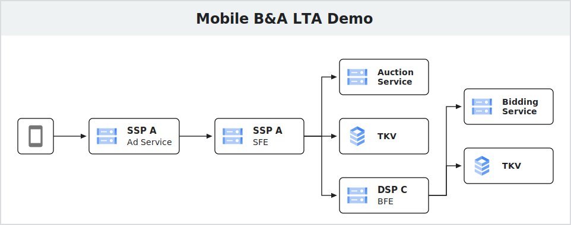

## Description

To ease the B&A testing process, the LTA provides the following participants:
* DSP-C 
* SSP-A 

Each participant provides mock bidding/scoring logic for B&A running locally to use.

After starting all the services and LTA, you can point the [Project Flight app](https://github.com/privacysandbox/project-flight) at SSP-A and see the B&A auctions take place.

## Quickstart

TL;DR: 
1. Setup prerequisites
2. Setup repositories
3. Build the B&A services
4. Build and start the DSP/SSP servers
5. Start the B&A services
6. Run [Project Flight](https://github.com/privacysandbox/project-flight) test app

### Setup prerequisites

#### Prepare a Linux machine

Use a Linux local machine, local VM, or provision a Linux VM from the cloud provider of your choice. Note that we will be connecting to port 6001 of this machine using the mobile test app. Make sure the port is accessible to your test device or Android emulator on your development machine so you can connect to it.

#### Install Docker

```bash
# Install Docker
> curl -fsSL https://get.docker.com -o get-docker.sh
> sudo sh get-docker.sh

# Test
> docker run hello-world

# Setup sudo-less Docker
> sudo groupadd docker
> sudo usermod -aG docker $USER
> newgrp docker
```

> With the sudo-less setup, the docker group grants root-level privileges to the user. Read the [sudo-less Docker](https://docs.docker.com/engine/install/linux-postinstall/#manage-docker-as-a-non-root-user) guide to learn more. 

### Setup the services

#### Pull down the Bidding and Auction Services repositories

For our demo, we will build and run four different B&A services to simulate auctions with our test DSP and SSP.

Clone the B&A server suite code:
```bash
git clone https://github.com/privacysandbox/bidding-auction-servers.git
```

#### Build the services

Execute the following command from the root of the `bidding-auction-servers` directory to build the B&A services: 

```bash
./production/packaging/build_and_test_all_in_docker \
  --service-path bidding_service \
  --service-path auction_service \
  --service-path buyer_frontend_service \
  --service-path seller_frontend_service \
  --platform gcp \
  --instance local \
  --no-precommit \
  --no-tests \
  --build-flavor non_prod \
  --gcp-skip-image-upload
```

#### Pull down and build the TKV service

When dealing with mobile clients, our B&A services are required to retrieve auction information from Trusted Key/Kalue (TKV) services.

Clone the TKV server code:
```bash
git clone https://github.com/privacysandbox/protected-auction-key-value-service.git
```

Execute the following command from the root of the `protected-auction-key-value-service` directory to build the TKV service: 

```bash
./production/packaging/build_and_test_all_in_docker \
  --platform local \
  --instance local \
  --no-precommit \
  --mode nonprod
```

[!NOTE] These build steps may take up to 3 hours on an 8-core machine and an hour on a 32-core machine (Sorry! We are working on improving this process!).  

[Relevant xkcd meme](https://xkcd.com/303/): 


### Build and run Local Testing App

Pull down this repository: 

```bash
git clone https://github.com/privacysandbox/bidding-auction-local-testing-app.git
```

From the root of the `bidding-auction-local-testing-app` directory, run the setup script: 

```bash
./setup
```

The setup script will create the `ba-dev` Docker network, generate SSL certificates, and build the images. 

Once the build is successful, run the start script: 

```bash
./start-mobile
```

### Start the services in local mode

Execute each command in a separate terminal window. A terminal manager such a [`tmux`](https://github.com/tmux/tmux/wiki) is highly recommended.

#### Mobile B&A (DSP-C and SSP-A)

Run the following commands in root folder of the `bidding-auction-servers` directory

##### DSP-C Bidding Service

```bash
DOCKER_RUN_ARGS_STRING="--ip=192.168.84.101 --network=ba-dev" \
BIDDING_JS_URL=https://192.168.84.100:5001/generate-bid.js \
SKIP_TLS_VERIFICATION=true \
  ./tools/debug/start_bidding
```

##### DSP-C BFE Service

```bash
DOCKER_RUN_ARGS_STRING="--ip=192.168.84.102 --network=ba-dev" \
BUYER_TKV_V2_SERVER_ADDR=192.168.84.106:50051 \
BIDDING_SERVER_ADDR=192.168.84.101:50057 \
SKIP_TLS_VERIFICATION=true \
  ./tools/debug/start_bfe
```

##### SSP-A Auction Service 

```bash
DOCKER_RUN_ARGS_STRING="--ip=192.168.84.103 --network=ba-dev" \
AUCTION_JS_URL="https://192.168.84.100:6001/score-ad.js" \
SKIP_TLS_VERIFICATION=true \
  ./tools/debug/start_auction
```

##### SSP-A SFE Service

```bash
DOCKER_RUN_ARGS_STRING="--ip=192.168.84.104 --network=ba-dev" \
SELLER_ORIGIN_DOMAIN="https://localhost:6001" \
AUCTION_SERVER_ADDR="192.168.84.103:50061" \
TRUSTED_KEY_VALUE_V2_SIGNALS_ADDR="192.168.84.105:50051" \
BUYER_SERVER_ADDRS_JSON='{"privacy-sandbox-flight.web.app":{"url":"192.168.84.102:50051","cloudPlatform":"LOCAL"}}' \
SKIP_TLS_VERIFICATION=true \
  ./tools/debug/start_sfe
```

#### TKV Services for Mobile B&A (DSP-C and SSP-A)

> [!IMPORTANT]
> Run the following commands in root folder of the `bidding-auction-local-testing-app` directory

##### DSP-C Trusted Key/Value Service

```bash
docker run --ip 192.168.84.106 --network ba-dev \
  -it --init --rm --name tkv-dsp-c \
  --volume=$PWD/src/participants/mobile/dsp-c/tkv/deltas:/tmp/deltas \
  --volume=$PWD/src/participants/mobile/dsp-c/tkv/realtime:/tmp/realtime \
  bazel/production/packaging/local/data_server:server_docker_image \
  -delta_directory=/tmp/deltas -realtime_directory=/tmp/realtime
```

##### SSP-A Trusted Key/Value Service

```bash
docker run --ip 192.168.84.105 --network ba-dev \
  -it --init --rm --name tkv-ssp-a \
  --volume=$PWD/src/participants/mobile/ssp-a/tkv/deltas:/tmp/deltas \
  --volume=$PWD/src/participants/mobile/ssp-a/tkv/realtime:/tmp/realtime \
  bazel/production/packaging/local/data_server:server_docker_image \
  -delta_directory=/tmp/deltas -realtime_directory=/tmp/realtime
```

### Run the Project Flight app

Follow the [Project Flight instructions](https://github.com/privacysandbox/project-flight) to run the example mobile apps in B&A mode to test the Bidding & Auction services you just set up.

## Design

* `SSP-A` - B&A-enabled seller 
* `DSP-C` - B&A-enabled buyer

### Architecture



* DSP-C - https://localhost:5001
* SSP-A - https://localhost:6001

### Docker network

The B&A stacks and the application communicate over the `ba-dev` Docker bridge network with the subnet of `192.168.84.0/24` ("84" represents "BA").  

To examine the `ba-dev` network, run `docker network inspect ba-dev` in the command line.

#### Auction participants

* DSP-C - https://192.168.84.100:5001
* SSP-A - https://192.168.84.100:6001

#### B&A Services

* BidServ - http://192.168.84.101:50057
* BFE - http://192.168.84.102:50051
* AucServ - http://192.168.84.103:50061
* SFE - http://192.168.84.104:50053

#### TKV Services

* TKV-SSP-A - grpc://192.168.84.105:50051
* TKV-DSP-C - grpc://192.168.84.106:50051